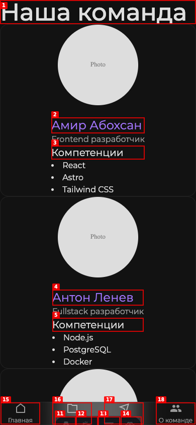
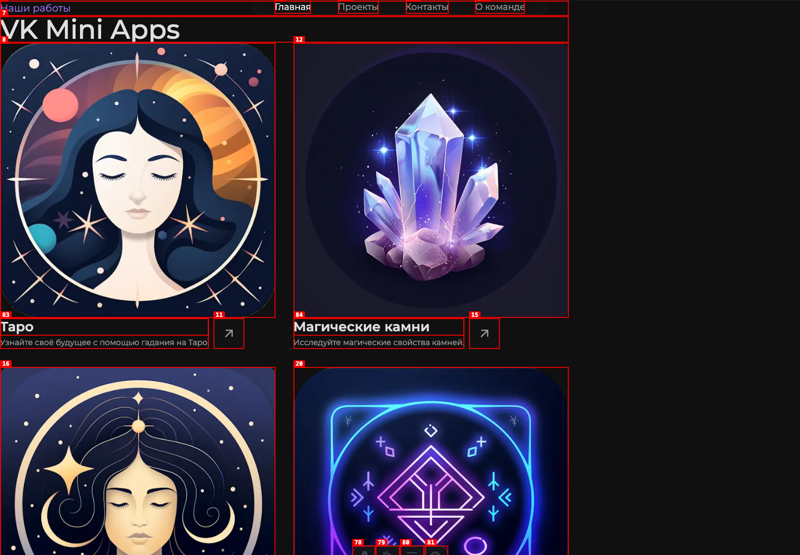
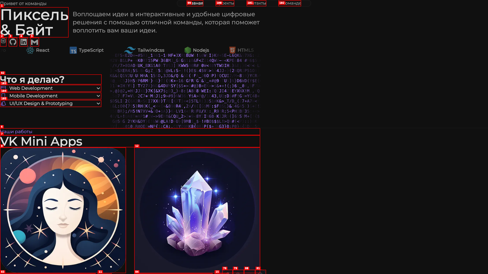
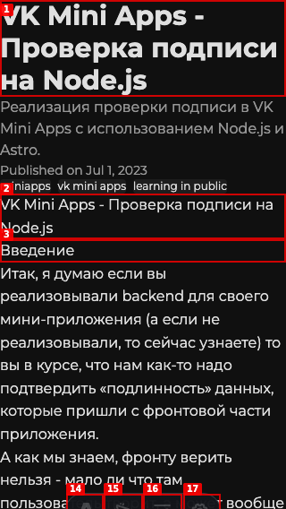
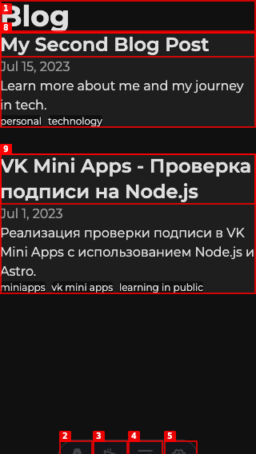
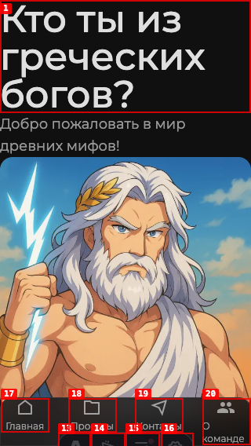

# Dogfood Report: Pixel & Byte

| Field       | Value                                |
| ----------- | ------------------------------------ |
| **Date**    | 2026-09-02                           |
| **App URL** | http://127.0.0.1:4321                |
| **Session** | pixel-byte-qa-a96e0df4b7a7           |
| **Scope**   | Full public site, desktop and mobile |

## Summary

| Severity  | Count |
| --------- | ----- |
| Critical  | 0     |
| High      | 0     |
| Medium    | 4     |
| Low       | 2     |
| **Total** | **6** |

## Resolution

All six findings were fixed in this pass and rechecked against the upgraded app on port 4322. Desktop content now centers at a measured 448 px left offset in a 1920 px viewport; mobile pages have measured 16 px gutters; blog routes include global navigation and footer; articles expose exactly one H1; placeholder portraits were replaced with branded initials; and axe-core reports zero WCAG A/AA violations on the home, blog, team, and project-detail routes.

## Issues

### ISSUE-001: Team profiles show unfinished placeholder portraits

| Field           | Value                      |
| --------------- | -------------------------- |
| **Severity**    | low                        |
| **Category**    | content / visual           |
| **URL**         | http://127.0.0.1:4321/team |
| **Repro Video** | N/A                        |

**Description**

Every team profile renders the same gray circle labeled “Photo”, making the public team page look unfinished. Expected real portraits or a deliberate branded fallback avatar; actual output exposes placeholder copy.

**Repro Steps**

1. Open the team page at a 390 × 844 viewport and observe the profile cards.
   

---

### ISSUE-006: Sixteen project-card links have no accessible name

| Field           | Value                           |
| --------------- | ------------------------------- |
| **Severity**    | medium                          |
| **Category**    | accessibility                   |
| **URL**         | http://127.0.0.1:4321/#projects |
| **Repro Video** | N/A                             |

**Description**

The WCAG audit reports 16 `link-name` violations on the project cards. Each icon-only external link has no discernible text, so a screen-reader user encounters unnamed links and cannot tell which action or project each one opens. Expected an `aria-label` (or equivalent visually hidden text) containing the project name and action.

**Repro Steps**

1. Open the projects section and inspect the annotated interactive map; the icon-only links between each card title/body and the named “Preview” link are present as blank link references.
   

---

### ISSUE-005: Desktop layout is pinned to the left half of wide screens

| Field           | Value                  |
| --------------- | ---------------------- |
| **Severity**    | medium                 |
| **Category**    | visual / responsive    |
| **URL**         | http://127.0.0.1:4321/ |
| **Repro Video** | N/A                    |

**Description**

At 1920 px wide the entire site stops at roughly 1024 px and remains flush-left, leaving almost half the viewport empty. The navigation is centered inside that left-hand block rather than within the browser, and the project grid is visually unbalanced. Expected a centered max-width container or a layout that uses the available width.

**Repro Steps**

1. Open the home page at a 1920 × 1080 viewport and observe the unused right half of the page.
   

---

### ISSUE-004: Blog posts repeat their title as two H1 headings

| Field           | Value                                                             |
| --------------- | ----------------------------------------------------------------- |
| **Severity**    | low                                                               |
| **Category**    | content / accessibility                                           |
| **URL**         | http://127.0.0.1:4321/blog/vk-mini-apps-signature-check-in-nodejs |
| **Repro Video** | N/A                                                               |

**Description**

The article title appears once in the post header and immediately again at the start of the article body. Both instances are level-one headings. This creates visible repetition and an ambiguous document outline for assistive technology.

**Repro Steps**

1. Open the VK Mini Apps article and observe the title immediately above and below the metadata row.
   

---

### ISSUE-003: Blog index is a navigation dead end and loses site styling

| Field           | Value                      |
| --------------- | -------------------------- |
| **Severity**    | medium                     |
| **Category**    | ux / visual                |
| **URL**         | http://127.0.0.1:4321/blog |
| **Repro Video** | N/A                        |

**Description**

The blog index omits the site navigation and footer entirely, so users cannot reach the home, projects, contact, or team pages without using browser history or editing the URL. It also drops the spacing and visual framing used everywhere else: cards and headings touch the viewport edge and tags render as tiny default underlined text.

**Repro Steps**

1. Open `/blog` at a 320 × 568 viewport and observe that only the article list is available, with no site navigation or footer.
   

---

### ISSUE-002: Project detail pages have no mobile page gutters

| Field           | Value                                   |
| --------------- | --------------------------------------- |
| **Severity**    | medium                                  |
| **Category**    | visual / responsive                     |
| **URL**         | http://127.0.0.1:4321/who_in_greek_gods |
| **Repro Video** | N/A                                     |

**Description**

At narrow mobile widths the title, supporting copy, and media sit directly against both viewport edges. The oversized title wraps into an awkward three-line block and the page reads as clipped rather than intentionally framed. The same zero-gutter layout appears on the other project detail pages.

**Repro Steps**

1. Open the Greek gods project page at a 320 × 568 viewport and observe the flush title, copy, and image.
   

---
